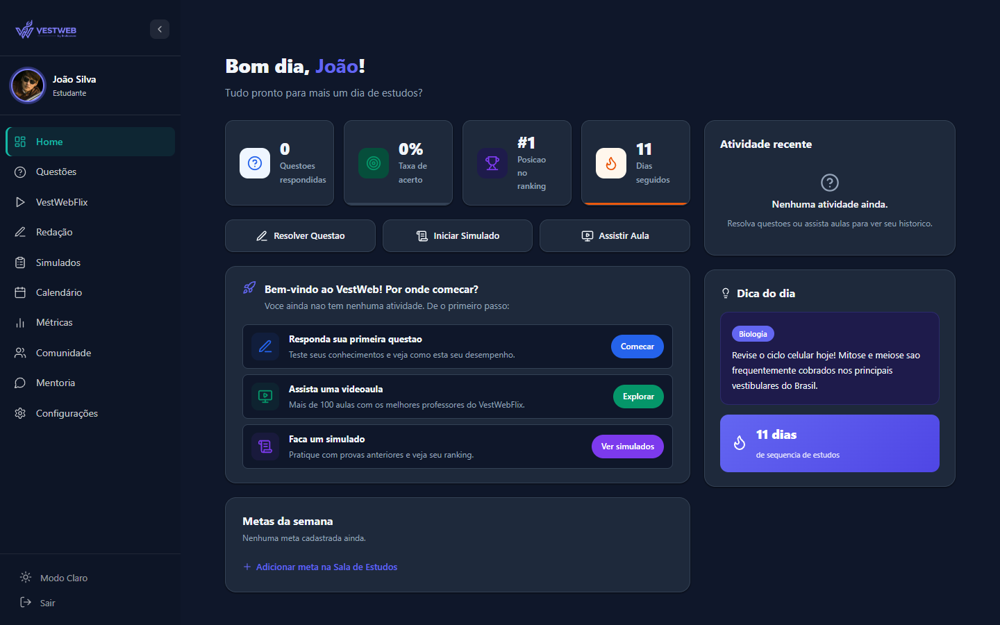
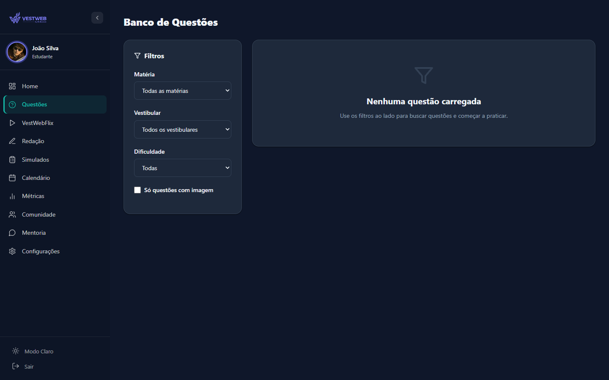
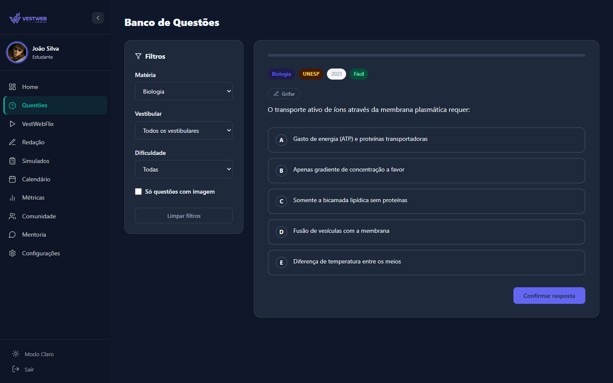
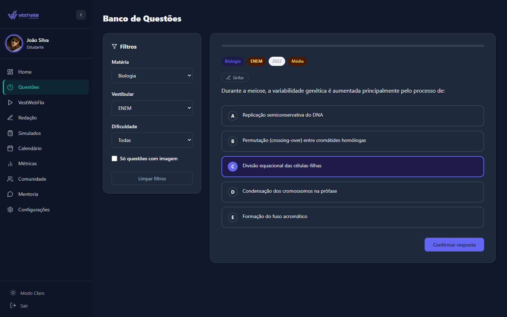
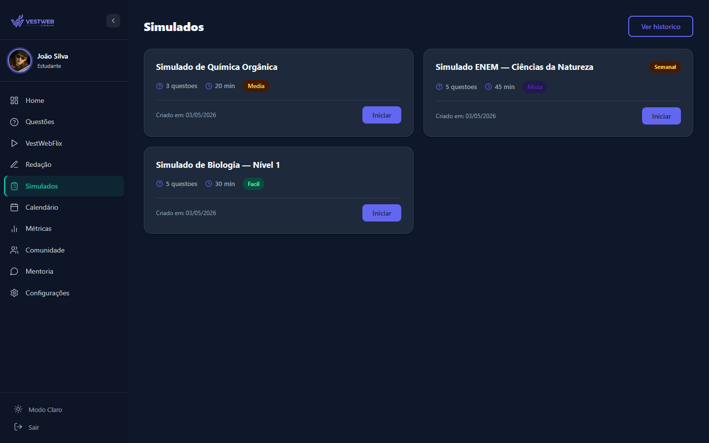
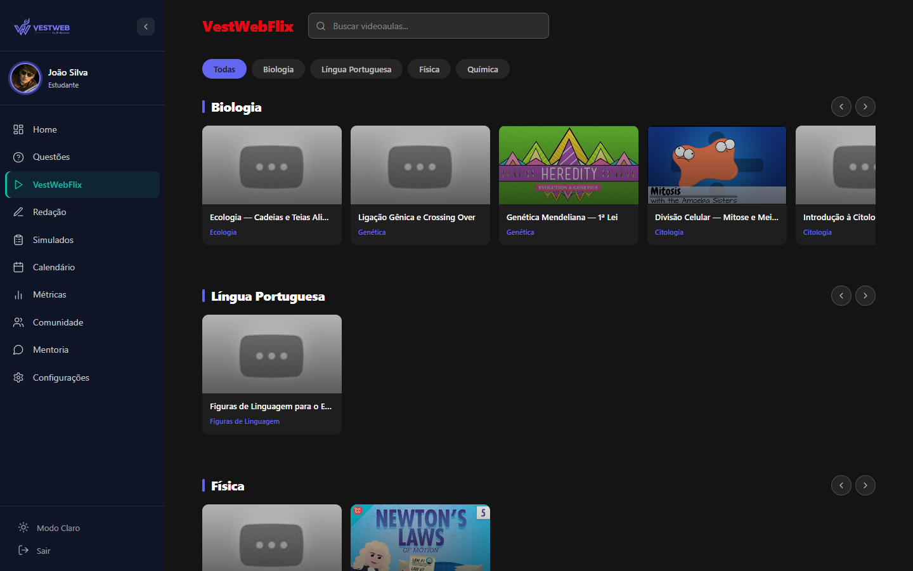
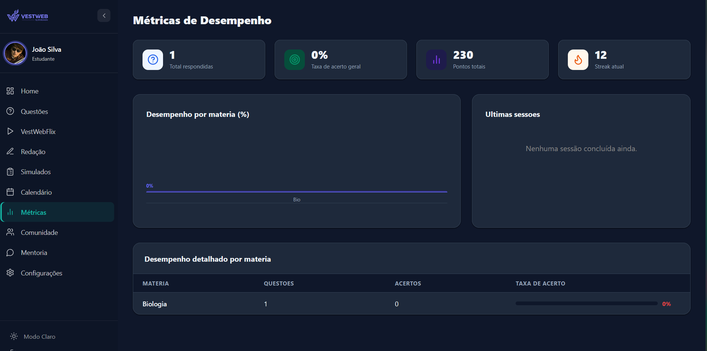
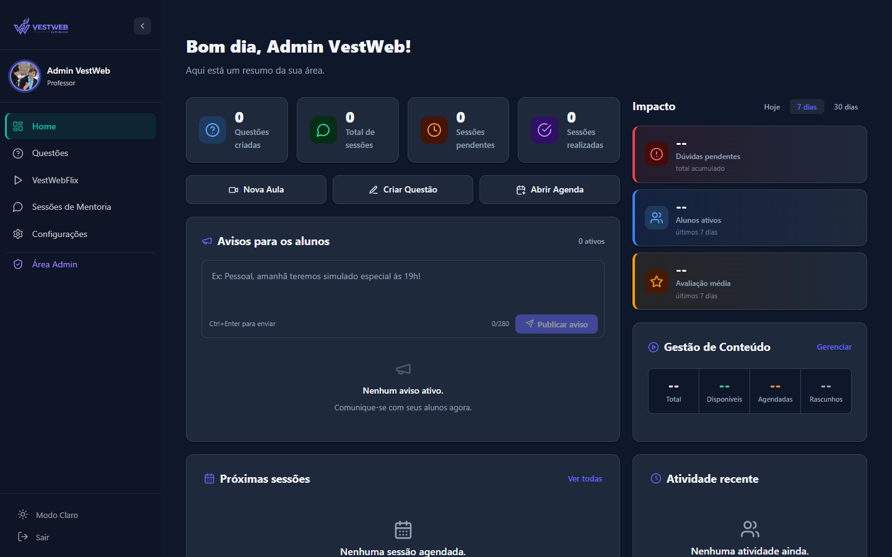
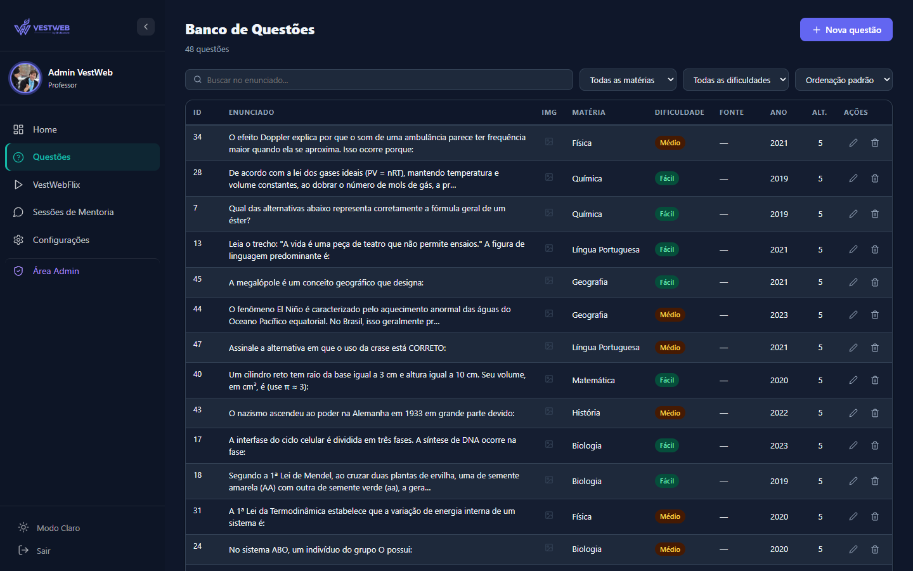
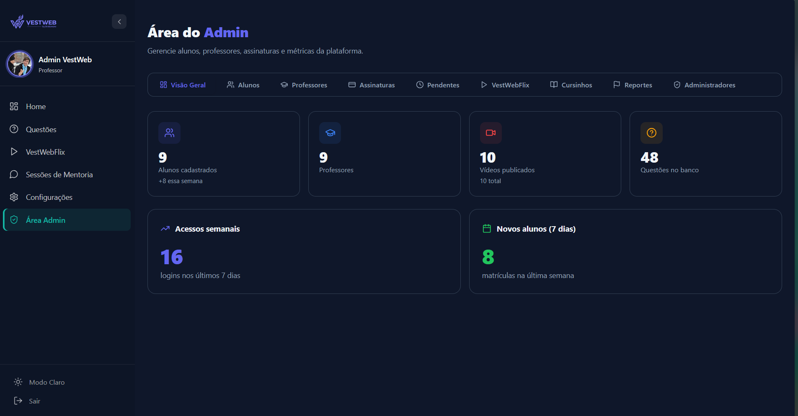

# VestWeb

> **Mais perto da sua aprovação** — plataforma completa de preparação ao vestibular.

Desenvolvido por [Bratloware](https://bratloware.com).

---

## Sobre o Produto

VestWeb é uma plataforma SaaS de estudos para vestibular com dois espaços distintos:

| Espaço | Público | Funcionalidades |
|---|---|---|
| **Espaço Aluno** | Vestibulandos | Dashboard, banco de questões, simulados, VestWebFlix, métricas e gamificação |
| **Espaço Colaborador** | Professores e admins | Portal do professor, criação de questões, sessões de mentoria, painel administrativo |

---

## Funcionalidades

### Espaço Aluno

- **Dashboard** — progresso semanal/mensal, acesso rápido, streak de dias e histórico de sessões
- **Banco de Questões** — 20.000+ questões filtráveis por matéria, vestibular (ENEM, FUVEST, UNICAMP…) e dificuldade, com feedback imediato de acerto/erro
- **Simulados** — provas cronometradas baseadas em vestibulares reais, gabarito comentado e histórico de desempenho comparativo
- **VestWebFlix** — 100+ videoaulas organizadas por matéria e tópico, progresso de conclusão, favoritos e filtros
- **Métricas & Gamificação** — taxa de acerto por matéria, sistema de XP e níveis, ranking global e conquistas (badges)

### Espaço Colaborador

- **Portal do Professor** — métricas de impacto, agenda de mentorias e feed de atividade recente
- **Gestão de Questões** — editor de enunciado com suporte a rich text, imagens e fórmulas; cadastro de até 5 alternativas; classificação por matéria, dificuldade e vestibular; rascunho ou publicação imediata
- **Painel Administrativo** — gestão de usuários (alunos, professores, cursinhos, admins), controle de assinaturas, estatísticas da plataforma e moderação de conteúdo

---

## Telas

### Espaço Aluno

**Dashboard**


**Banco de Questões**


| Filtro por Matéria | Respondendo |
|---|---|
|  |  |

**Simulados**


**VestWebFlix**


**Métricas & Gamificação**


### Espaço Colaborador

**Portal do Professor**


**Gestão de Questões**


**Painel Administrativo**


---

## Stack

| Camada | Tecnologia |
|---|---|
| Frontend | React 18 + Vite + TypeScript + Tailwind CSS |
| Backend | Node.js + Express + Sequelize |
| ENEM API | Next.js + Prisma (serviço separado) |
| Banco de dados | PostgreSQL (Supabase em produção) |
| Autenticação | JWT |
| Pagamentos | Stripe |

---

## Estrutura do Repositório

```
VestWeb/
├── client/          # Frontend React + Vite
├── server/          # Backend Node.js + Express
├── enem-api/        # API de questões ENEM (Next.js + Prisma)
├── e2e/             # Testes end-to-end
└── docker-compose.yml
```

---

## Dev Local

### Pré-requisitos

- Node.js 20+
- Docker e Docker Compose (para o banco)
- Variáveis de ambiente configuradas (ver `.env.example` em cada pasta)

### Subindo o ambiente

```bash
# Banco de dados (PostgreSQL via Docker)
docker-compose up -d db

# Backend
cd server
npm install
npm run dev

# Frontend (em outro terminal)
cd client
npm install
npm run dev
```

Frontend disponível em `http://localhost:5173`, API em `http://localhost:3001`.

### Variáveis de ambiente

**`server/.env`**

```env
DATABASE_URL=           # Connection string PostgreSQL (prioridade sobre DB_* individuais)
DB_HOST=localhost
DB_PORT=5432
DB_NAME=vestweb
DB_USER=postgres
DB_PASSWORD=
CLIENT_URL=http://localhost:5173   # Origens CORS (separadas por vírgula)
JWT_SECRET=
STRIPE_SECRET_KEY=
STRIPE_WEBHOOK_SECRET=
EMAIL_USER=
EMAIL_TO=
```

**`client/.env`**

```env
VITE_API_URL=           # Deixar vazio usa proxy Vite para /api em dev
```

---

## Docker (ambiente completo)

```bash
docker-compose up --build
```

Sobe PostgreSQL, backend e frontend em conjunto.

---

## Deploy

| Serviço | Plataforma | Config |
|---|---|---|
| Frontend | Vercel | root dir: `client/` |
| Backend | Railway | root dir: `server/`, `railway.toml` |
| Banco | Supabase | PostgreSQL gerenciado |

---

## Notas Técnicas

- O backend usa **dois ORMs em paralelo**: Sequelize (modelos principais — 35+ tabelas) e Prisma (tabelas de questões importadas do ENEM)
- `server/` usa ES modules (`"type": "module"`)
- O Stripe webhook exige `express.raw()` **antes** do `express.json()` — já configurado em `app.js`
- Uploads de arquivos usam `multer` com `memoryStorage()` (sem escrita em disco)
- Pool Sequelize: máximo de 5 conexões simultâneas

---

*VestWeb by Bratloware — 2026*
